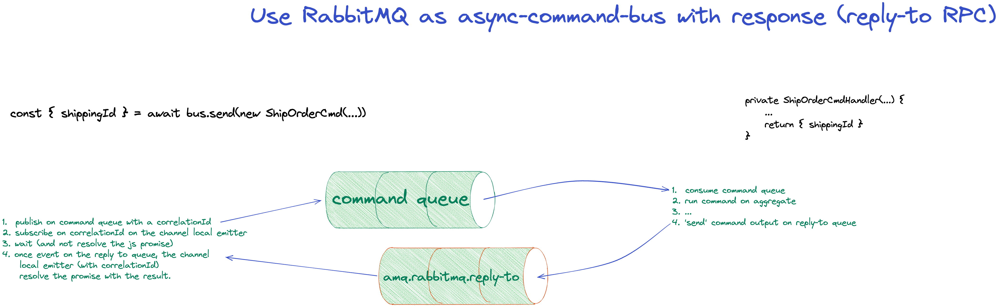

# Rabbitmq RPC with reply-to queues example

### Usage

Follow this steps:

- Install package dependencies with `npm i`
- Run RabbitMQ broker locally on Docker with `docker run -p 5672:5672 rabbitmq:3`
- Run the command handler example with `ts-node src/cmd-handler.ts`
- Run the command sender example with `ts-node src/cmd-sender.ts`

---

